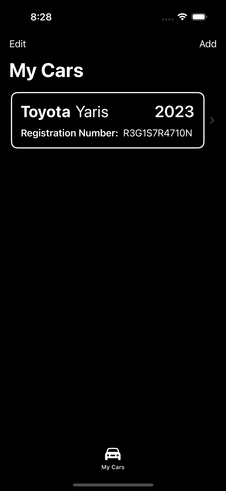
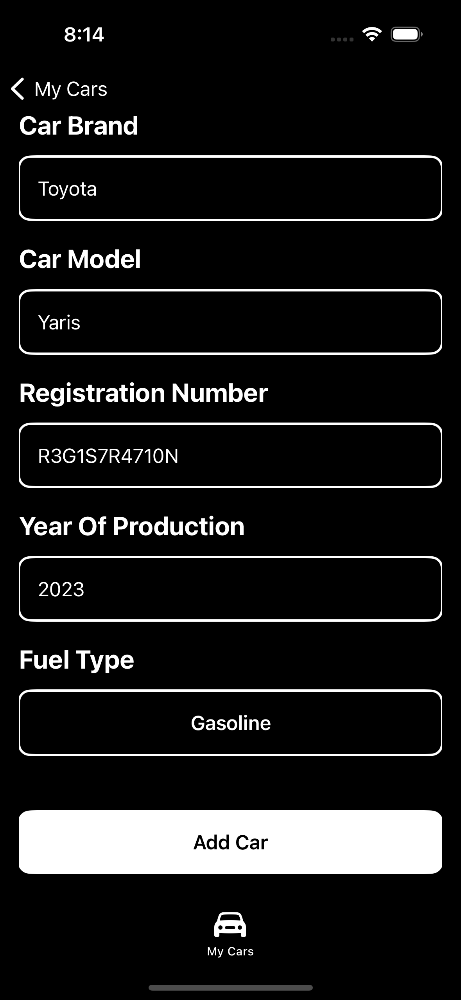
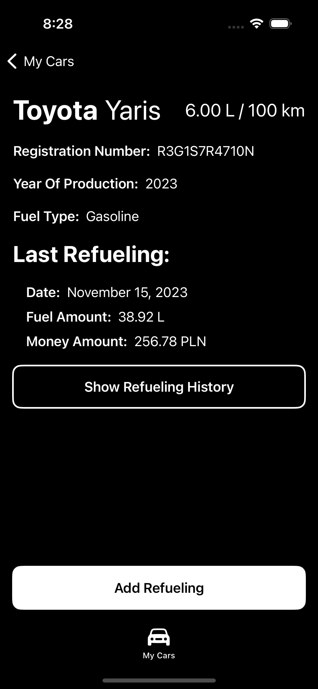
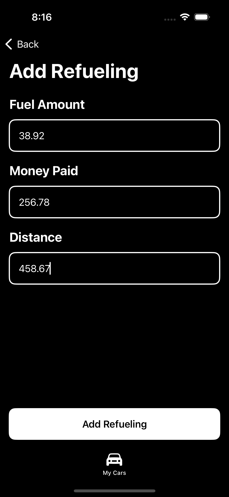
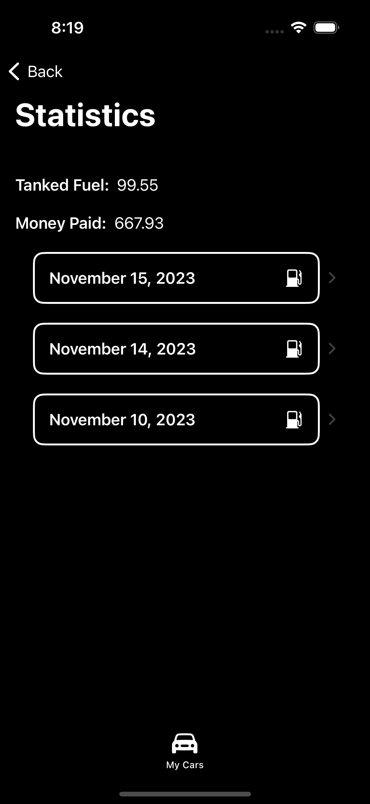
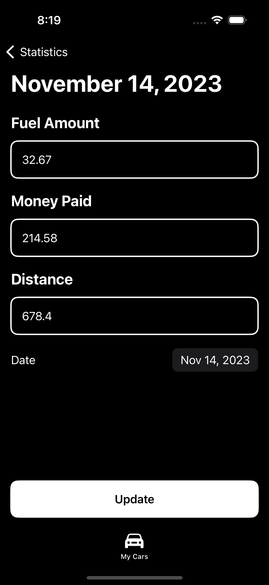

# Fuel Consumption App

Basic iOS app that counts average fuel consumption for cars. I tried to learn UserDefaults and MVVM architecture by this project.

## Technologies
 - Swift 
	 - UserDefaults
 - SwiftUI
	 - Auto Dark/Light Mode

 

## Roadmap
 - Add Trips tab where you can create trip, add cars and participants. Trip would show how many money each person should pay for fuel. Refuelling history would be saved to selected cars.
 - Add Settings tab, where you can select dark, light, custom dark and custom light modes.

## Screenshots

